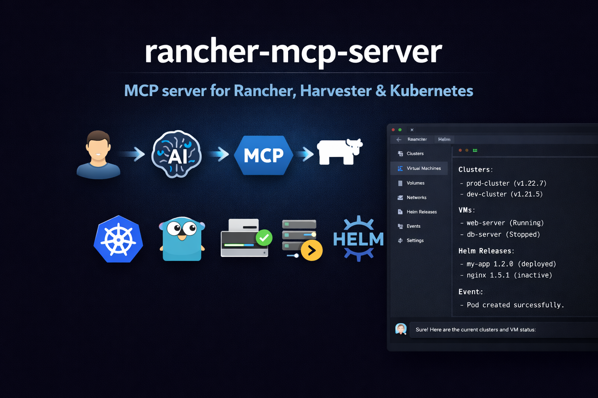

# rancher-mcp-server

[](https://github.com/mrostamii/rancher-mcp-server/blob/main/LICENSE)
[](https://www.npmjs.com/package/rancher-mcp-server)
[](https://github.com/mrostamii/rancher-mcp-server/releases/latest)
[](https://github.com/mrostamii/rancher-mcp-server/actions/workflows/release-please.yml)



Model Context Protocol (MCP) server for the **Rancher ecosystem**: multi-cluster Kubernetes, Harvester HCI (VMs, storage, networks), and Fleet GitOps.

### Demo

A walkthrough of how this MCP server works (example in Cursor).

https://github.com/user-attachments/assets/7d8fb814-e504-47b4-956d-28f43aeea3b8

## Features

- **Harvester toolset**: List/get VMs, images, volumes, networks, hosts; VM actions; addon list/switch (enable/disable)
- **Rancher toolset**: List clusters and projects, cluster get, overview (management API)
- **Kubernetes toolset**: List/get/create/patch/delete resources by apiVersion/kind; describe (resource + events), events, capacity
- **Helm toolset**: List/get/history of releases; install, upgrade, rollback, uninstall; repo list
- **Fleet toolset**: GitRepo list/get/create; Bundle list; Fleet cluster list; drift detection
- **Rancher Steve API**: Single token, multi-cluster access; no CLI wrappers
- **Security**: Read-only default, disable-destructive, sensitive data masking
- **Config**: Flags, env (`RANCHER_MCP_*`), or file (YAML/TOML)

## Quick start

### Install

```bash
npm install -g rancher-mcp-server
```

### Cursor

Add to `.cursor/mcp.json` (project-level) or `~/.cursor/mcp.json` (global):

```json
{
  "mcpServers": {
    "rancher": {
      "command": "npx",
      "args": [
        "-y", "rancher-mcp-server",
        "--rancher-server-url", "https://rancher.example.com",
        "--rancher-token", "token-xxxxx:yyyy",
        "--toolsets", "harvester,rancher,kubernetes,fleet"
      ]
    }
  }
}
```

Restart Cursor after saving. Check **Settings → Tools & MCP** that **rancher** is listed and enabled.

### Claude Desktop

Add to your Claude Desktop config (`claude_desktop_config.json`):

```json
{
  "mcpServers": {
    "rancher": {
      "command": "npx",
      "args": [
        "-y", "rancher-mcp-server",
        "--rancher-server-url", "https://rancher.example.com",
        "--rancher-token", "token-xxxxx:yyyy",
        "--toolsets", "harvester,rancher,kubernetes,fleet"
      ]
    }
  }
}
```

### With env vars instead of args

If you prefer to keep the token out of the JSON config:

```json
{
  "mcpServers": {
    "rancher": {
      "command": "npx",
      "args": ["-y", "rancher-mcp-server"],
      "env": {
        "RANCHER_MCP_RANCHER_SERVER_URL": "https://rancher.example.com",
        "RANCHER_MCP_RANCHER_TOKEN": "token-xxxxx:yyyy",
        "RANCHER_MCP_TOOLSETS": "harvester,rancher,kubernetes"
      }
    }
  }
}
```

### Enable write operations

For VM create, snapshots, backups, image/volume create, addon switch, host maintenance mode, VPC create/update/delete, Kubernetes create/patch/delete, Helm install/upgrade/rollback, and Fleet gitrepo create/delete, add `--read-only=false`. Delete operations also require `--disable-destructive=false` (default).

```json
{
  "mcpServers": {
    "rancher": {
      "command": "npx",
      "args": [
        "-y", "rancher-mcp-server",
        "--rancher-server-url", "https://rancher.example.com",
        "--rancher-token", "token-xxxxx:yyyy",
        "--toolsets", "harvester,rancher,kubernetes,helm,fleet",
        "--read-only=false"
      ]
    }
  }
}
```

### HTTP/SSE transport

For web clients or remote access, add `--transport` and `--port`:

```json
{
  "mcpServers": {
    "rancher": {
      "command": "npx",
      "args": [
        "-y", "rancher-mcp-server",
        "--rancher-server-url", "https://rancher.example.com",
        "--rancher-token", "token-xxxxx:yyyy",
        "--transport", "http",
        "--port", "8080"
      ]
    }
  }
}
```

The server exposes the MCP endpoint over HTTP/SSE (e.g. `http://localhost:8080/sse`).

### Build from source

If you prefer to build the Go binary yourself:

```bash
go build -o rancher-mcp-server ./cmd/rancher-mcp-server
```

Then reference the binary directly in your MCP config:

```json
{
  "mcpServers": {
    "rancher": {
      "command": "/absolute/path/to/rancher-mcp-server",
      "args": [
        "--rancher-server-url", "https://rancher.example.com",
        "--rancher-token", "token-xxxxx:yyyy",
        "--toolsets", "harvester,rancher,kubernetes,fleet"
      ]
    }
  }
}
```

---

## Configuration


| Option                        | Env                                     | Default   | Description                                                               |
| ----------------------------- | --------------------------------------- | --------- | ------------------------------------------------------------------------- |
| `--rancher-server-url`        | `RANCHER_MCP_RANCHER_SERVER_URL`        | —         | Rancher server URL (required)                                             |
| `--rancher-token`             | `RANCHER_MCP_RANCHER_TOKEN`             | —         | Bearer token (required)                                                   |
| `--tls-insecure`              | `RANCHER_MCP_TLS_INSECURE`              | false     | Skip TLS verification                                                     |
| `--read-only`                 | `RANCHER_MCP_READ_ONLY`                 | true      | Disable write operations                                                  |
| `--disable-destructive`       | `RANCHER_MCP_DISABLE_DESTRUCTIVE`       | false     | Disable delete operations                                                 |
| `--toolsets`                  | `RANCHER_MCP_TOOLSETS`                  | harvester | Toolsets to enable: harvester, rancher, kubernetes, helm, fleet         |
| `--transport`                 | `RANCHER_MCP_TRANSPORT`                | stdio     | Transport: stdio or http (HTTP/SSE)                                      |
| `--port`                      | `RANCHER_MCP_PORT`                     | 0         | Port for HTTP/SSE (0 = stdio only)                                        |

---

## Harvester tools


| Tool                      | Description                                                       |
| ------------------------- | ----------------------------------------------------------------- |
| `harvester_vm_list`       | List VMs with status, namespace, spec/status                      |
| `harvester_vm_get`        | Get one VM (full spec and status)                                 |
| `harvester_vm_action`     | start, stop, restart, pause, unpause, migrate                     |
| `harvester_vm_create`     | Create VM (when not read-only). Supports network, interface_type (managedtap/bridge/masquerade), subnet for KubeOVN VPC. |
| `harvester_vm_snapshot`   | Create/list/restore/delete VM snapshots                            |
| `harvester_vm_backup`     | Create/list/restore VM backups (Backup Target)                    |
| `harvester_image_list`    | List VM images (VirtualMachineImage)                              |
| `harvester_image_create`  | Create VM image from URL (when not read-only)                      |
| `harvester_volume_list`   | List PVCs (Longhorn-backed volumes)                               |
| `harvester_volume_create` | Create volume/PVC (optionally from image)                          |
| `harvester_network_list`    | List VM networks (NetworkAttachmentDefinition)                     |
| `harvester_network_create` | Create VM network - KubeOVN overlay or VLAN (when not read-only)   |
| `harvester_network_update` | Update VM network config (when not read-only)                       |
| `harvester_network_delete` | Delete VM network (when destructive allowed)                       |
| `harvester_subnet_list`    | List KubeOVN Subnets (requires kubeovn-operator)                   |
| `harvester_subnet_create`  | Create Subnet in VPC for VM network (when not read-only)           |
| `harvester_subnet_update`  | Update Subnet namespaces/NAT (when not read-only)                   |
| `harvester_subnet_delete`  | Delete Subnet (when destructive allowed)                           |
| `harvester_host_list`     | List nodes (Harvester hosts)                                      |
| `harvester_host_action`  | Enable/disable maintenance mode on a host (cordon/uncordon)        |
| `harvester_settings`     | List or get Harvester cluster settings (backup-target, etc.)      |
| `harvester_addon_list`    | List Harvester addons (enabled/disabled state)                     |
| `harvester_addon_switch`  | Enable or disable an addon (when not read-only)                   |
| `harvester_vpc_list`      | List KubeOVN VPCs (requires kubeovn-operator addon)               |
| `harvester_vpc_create`    | Create a KubeOVN VPC (when not read-only)                        |
| `harvester_vpc_update`    | Update a KubeOVN VPC namespaces (when not read-only)               |
| `harvester_vpc_delete`    | Delete a KubeOVN VPC (when destructive allowed)                   |

List tools accept `cluster` (required), `namespace`, `format` (json|table), `limit` (default 100), `continue` (pagination token for next page). Write tools require `read_only: false`.

### Creating a VM on KubeOVN VPC with external internet

Use `harvester_vm_create` with:

1. **network**: Name of the overlay network (NAD) linked to a KubeOVN subnet. Create via `harvester_network_create` (type=kubeovn) then `harvester_subnet_create` with `provider={network}.{namespace}.ovn`, `vpc=<vpc-name>`, and `nat_outgoing=true`.
2. **interface_type**: `managedtap` (recommended for KubeOVN) or `bridge`. Uses Multus as primary network.
3. **subnet**: Optional KubeOVN subnet name for `ovn.kubernetes.io/logical_switch` annotation.

Example: VM on network `vswitch1` in namespace `default`, managedTap interface, subnet `vswitch1-subnet`:

```
harvester_vm_create cluster=<cluster-id> namespace=default name=testvm image=<image> network=vswitch1 interface_type=managedtap subnet=vswitch1-subnet
```

## Rancher tools


| Tool                   | Description                                   |
| ---------------------- | --------------------------------------------- |
| `rancher_cluster_list` | List Rancher clusters (management)            |
| `rancher_cluster_get`  | Get one cluster (health, version, node count) |
| `rancher_project_list` | List Rancher projects                         |
| `rancher_overview`     | Overview: cluster count and project count     |


Uses Rancher management API (cluster ID `local`). No `cluster` param.

## Helm tools

| Tool                  | Description                                                         |
| --------------------- | ------------------------------------------------------------------- |
| `helm_list`           | List Helm releases (optionally by namespace, deployed/failed/pending) |
| `helm_get`            | Get release details (manifest, values, notes)                       |
| `helm_history`        | Get revision history for a release                                  |
| `helm_repo_list`      | List configured Helm chart repositories (from local config)          |
| `helm_install`        | Install a Helm chart (when not read-only)                           |
| `helm_upgrade`        | Upgrade a Helm release (when not read-only)                         |
| `helm_rollback`       | Rollback a release to a previous revision (when not read-only)      |
| `helm_uninstall`      | Uninstall a release (when destructive allowed)                      |

All tools take `cluster` (Rancher cluster ID). Install/upgrade require `chart`, `release`; optional `repo_url`, `version`, `values` (JSON).

## Fleet tools

| Tool                     | Description                                                         |
| ------------------------ | ------------------------------------------------------------------- |
| `fleet_gitrepo_list`     | List Fleet GitRepos (GitOps sources)                                |
| `fleet_gitrepo_get`      | Get one GitRepo (spec, status)                                      |
| `fleet_gitrepo_create`   | Create a GitRepo (when not read-only)                               |
| `fleet_gitrepo_delete`   | Delete a GitRepo (when destructive allowed)                          |
| `fleet_gitrepo_action`   | Pause, unpause, disablePolling, enablePolling, forceUpdate           |
| `fleet_gitrepo_clone`    | Clone a GitRepo to a new name (copy spec)                            |
| `fleet_bundle_list`     | List Fleet Bundles (deployment units from GitRepos)                  |
| `fleet_cluster_list`     | List Fleet clusters (downstream clusters registered with Fleet)      |
| `fleet_drift_detect`     | Report BundleDeployments with Modified state (drift)                 |

All tools use the Rancher management cluster (`local`). Optional `namespace` (default: fleet-default). List tools support `format`, `limit`, `continue` (pagination). `fleet_gitrepo_create` requires `name`, `repo`; optional `branch`, `paths`. `fleet_gitrepo_action` supports: pause, unpause, disablePolling, enablePolling, forceUpdate. `fleet_gitrepo_clone` copies spec from an existing GitRepo to a new name.

## Kubernetes tools


| Tool                  | Description                                                         |
| --------------------- | ------------------------------------------------------------------- |
| `kubernetes_list`     | List resources by apiVersion/kind (e.g. v1 Pod, apps/v1 Deployment) |
| `kubernetes_get`      | Get one resource by apiVersion, kind, namespace, name               |
| `kubernetes_describe` | Get resource + recent events                                        |
| `kubernetes_events`   | List events in a namespace (optional involvedObject filter)         |
| `kubernetes_capacity` | Node capacity/allocatable summary per node                          |
| `kubernetes_create`   | Create resource from JSON (when not read-only)                      |
| `kubernetes_patch`    | Patch resource with JSON (when not read-only)                       |
| `kubernetes_delete`   | Delete resource (when destructive allowed)                          |


All tools take `cluster` (Rancher cluster ID). List/get support `namespace`, `format` (json|table), `limit`, `continue` (pagination). Create/patch/delete are gated by `read_only` and `disable_destructive`.

---

## Setup: Rancher token & Harvester cluster ID

### Get a Rancher API token

1. Log in to your Rancher UI.
2. Click your **profile/avatar** (top right) → **Account & API Keys** (or **API & Keys**).
3. Click **Create API Key**, name it (e.g. `mcp-server`), then **Create**.
4. Copy the token once (format like `token-abc12:xyz...`). Use it as `--rancher-token` or `RANCHER_MCP_RANCHER_TOKEN`.

### Find your Harvester cluster ID

Harvester tools require the **cluster ID** (e.g. `c-tx8rn`) on each call.

- **From Rancher UI:** Go to Cluster Management → open your Harvester cluster. The URL contains the cluster ID: `.../c/<cluster-id>/...`.
- **From API:** `curl -s -H "Authorization: Bearer YOUR_TOKEN" "https://YOUR_RANCHER_URL/v1/management.cattle.io.clusters" | jq '.data[] | {name: .metadata.name}'`

---

## Docker (HTTP/SSE only)

For **HTTP/SSE server mode**, use the container image from [GitHub Container Registry](https://github.com/features/packages) (ghcr.io). For Cursor/Claude with stdio, use **npm** (see Quick start).

Run the server in SSE mode and expose the port:

```bash
docker run -d -p 8080:8080 \
  -e RANCHER_MCP_RANCHER_SERVER_URL=https://rancher.example.com \
  -e RANCHER_MCP_RANCHER_TOKEN="token-xxxxx:yyyy" \
  -e RANCHER_MCP_TRANSPORT=http \
  -e RANCHER_MCP_PORT=8080 \
  ghcr.io/mrostamii/rancher-mcp-server:latest
```

Connect Cursor or Claude Desktop via the SSE URL: `http://localhost:8080/sse`
---

## Supported platforms

- macOS (Apple Silicon & Intel)
- Linux (x64 & ARM64)
- Windows (x64)

---

## Troubleshooting


| Issue                                               | What to check                                                                                        |
| --------------------------------------------------- | ---------------------------------------------------------------------------------------------------- |
| "rancher-server-url and rancher-token are required" | Check `--rancher-server-url` and `--rancher-token` in args, or env vars `RANCHER_MCP_RANCHER_SERVER_URL` and `RANCHER_MCP_RANCHER_TOKEN`. |
| 401 Unauthorized                                    | Token expired or invalid. Create a new API key in Rancher.                                           |
| TLS / certificate errors                            | For self-signed Rancher, pass `--tls-insecure` (dev only).                                           |
| "cluster not found" or empty lists                  | Wrong cluster ID. Get it from Rancher UI URL or API; pass it as `cluster` to Harvester/Kubernetes tools. |
| Cursor doesn't show tools                           | Restart Cursor after editing `mcp.json`; check **Tools & MCP** that the server is enabled.           |
| Binary not found                                    | Use **absolute** paths in `mcp.json` for `command` when building from source.                        |


---

## License

Apache-2.0
